[](https://travis-ci.com/bodgit/terraonion)
[](https://goreportcard.com/report/github.com/bodgit/terraonion)
[](https://godoc.org/github.com/bodgit/terraonion)

# Terraonion
A collection of libraries and utilities for some of the Terraonion products.

Installation:
```
go get github.com/bodgit/terraonion/...
```
## neosd
The `neosd` utility creates `.neo` files suitable for the NeoSD cartridge using a zip archive or directory containing Neo Geo ROM images.

If the base filename, minus any preceding path or extension, matches the name of a game known to MAME then the ROM images will be unscrambled and processed based on the same logic MAME uses. If the game is also a clone of another game then the utility will attempt to find any missing ROM images in a zip archive or directory based on the name of the parent game.

If the game is not known to MAME then the filenames of the individual ROM images are used to try and best work out how to process the game.

A quick demo:


